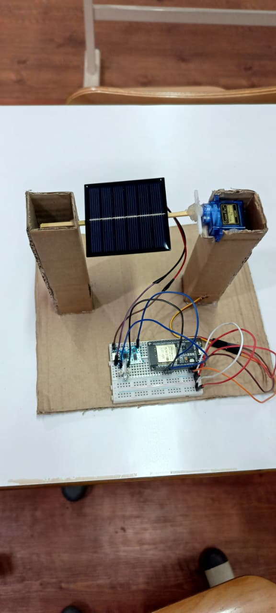
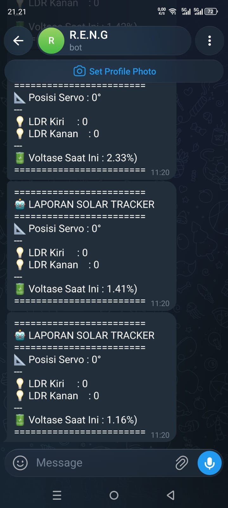

# IoT-Based Smart Solar Tracker System (Project R.E.N.G)

Proyek ini merupakan sistem pemantau dan pelacak arah cahaya matahari (*Solar Tracker*) berbasis **Internet of Things (IoT)** menggunakan mikrokontroler **ESP32 NodeMCU**. Alat ini dirancang untuk mengoptimalkan penyerapan energi pada panel surya dengan cara menggerakkan motor servo secara aktif mengikuti posisi intensitas cahaya tertinggi dari sensor LDR. Status operasional alat dilaporkan secara *real-time* ke smartphone melalui **Telegram Bot API**.

---

## 🚀 Fitur Utama
* **Dual-Axis/Single-Axis Light Tracking:** Menggunakan 2 sensor LDR dengan metode komparator diferensial untuk melacak pergerakan sumber cahaya secara responsif.
* **IoT Remote Monitoring:** Mengirimkan laporan berkala (sudut servo, nilai intensitas sensor LDR, dan tegangan baterai) langsung ke Telegram Bot.
* **Voltage-Based Power Monitoring:** Memantau tegangan riil sisa baterai penyuplai menggunakan rangkaian *voltage divider* 3-resistor demi keamanan pin analog ESP32.
* **Power Efficient Logic:** Motor servo hanya akan bergerak jika selisih pembacaan cahaya melewati ambang batas (toleransi) tertentu untuk menghemat konsumsi daya baterai.

---

## 🛠️ Daftar Komponen & Perangkat Keras
1. **ESP32 NodeMCU Development Board** (Otak Utama & Pemroses IoT)
2. **Motor Servo (SG90 / MG995)** (Penggerak Mekanis Panel)
3. **2x Sensor LDR (Light Dependent Resistor)** (Sensor Intensitas Cahaya)
4. **2x Resistor 10k Ohm** (Pembagi Tegangan untuk Sensor LDR)
5. **3x Resistor Seri** (Rangkaian Pembagi Tegangan untuk Sensor Baterai)
6. **Modul Charger TP4056** (Sistem Manajemen Pengisian Daya Baterai)
7. **2x Baterai Lithium 18650 + Holder Dual Slot** (Sumber Daya Mandiri / *Self-Powered*)
8. **Breadboard Putih & Kabel Jumper Male-to-Male** (Media Penghubung Sirkuit)

---

## 📐 Skema Kelistrikan & Pin Out (ESP32)
| Komponen | Pin ESP32 | Deskripsi |
| :--- | :--- | :--- |
| **LDR Kiri** | `G34` (Pin 19) | Input Analog Sinyal LDR Sisi Kiri |
| **LDR Kanan** | `G35` (Pin 20) | Input Analog Sinyal LDR Sisi Kanan |
| **Signal Servo** | `D13` (Pin 28) | Output PWM Pengendali Motor Servo |
| **Sensor Baterai**| `G32` (Pin 27) | Input Analog Pertemuan Resistor Pembagi Tegangan |
| **VCC Servo** | `VIN` (Pin 30) | Suplai Daya Positif dari Baterai/USB |
| **GND** | `GND` | Jalur *Ground* Bersama (*Common Ground*) |

---

## 🧠 Logika Kerja Sistem (Flowchart Logic)

### 1. Tahap Input & Sensor
* Dua sensor LDR kiri (`G34`) dan kanan (`G35`) membaca nilai analog intensitas cahaya secara berkala. Rangkaian baterai menyalurkan tegangan ke pin `G32` melalui 3 resistor penyaring daya.

### 2. Algoritma Tracking Pergerakan
* Nilai analog LDR Kiri (`nilaiKiri`) dan LDR Kanan (`nilaiKanan`) dibandingkan oleh program.
* **Jika Kanan disenter** (Nilai ADC Kanan < Kiri - Toleransi), sudut posisi servo berkurang secara bertahap (`posisiServo -= 3`) $\rightarrow$ Maket berputar ke Kanan.
* **Jika Kiri disenter** (Nilai ADC Kiri < Kanan - Toleransi), sudut posisi servo bertambah secara bertahap (`posisiServo += 3`) $\rightarrow$ Maket berputar ke Kiri.
* Jika selisih berada di dalam batas toleransi, servo akan diam (*Lock Position*).

### 3. Logika IoT & Laporan Tegangan
* Setiap 3 detik sekali (`jedaKirim`), ESP32 menghitung konversi pembacaan nilai ADC baterai menjadi satuan tegangan murni mVolt/Volt nyata (*Voltage-Based SoC*). 
* Data string yang sudah rapi dikirimkan secara nirkabel menggunakan library `UniversalTelegramBot` menuju ke ID Telegram pengguna.

---

## 💻 Prasyarat & Library Arduino IDE
Sebelum melakukan *upload* kode ke ESP32, pastikan library berikut sudah terinstal di Arduino IDE Anda:
* `WiFi.h` (Bawaan ESP32)
* `WiFiClientSecure.h` (Bawaan ESP32)
* `UniversalTelegramBot` (Oleh Brian Gallati)
* `ESP32Servo` (Oleh Kevin Harrington)

---

## 🧑‍💻 Anggota Kelompok R.E.N.G
* **Muhammad Hanif Nasrulloh**
* **Ahmad Nur Mustakim**
* **Edric Liyandi**
* **Maladi**
* **Syaghaf Mahardika Putra**

## 📸 Dokumentasi Perangkat & Pengujian

### Maket Solar Tracker

### Hasil Monitoring Telegram Bot

---
Copyright © 2026 Kelompok R.E.N.G - Universitas Bina Sarana Informatika. All Rights Reserved.
